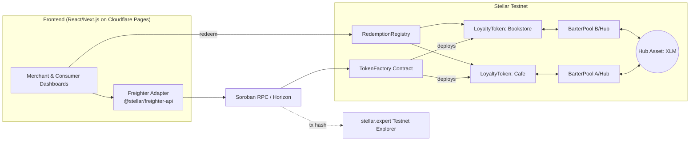

# BarterNet — Cross-Merchant Loyalty Liquidity Engine
### Product Requirements Document (PRD)

---

## 1. Executive Summary

BarterNet lets small, independent merchants (a coffee shop, a bookstore, a barber, a florist) each mint their own loyalty token in a few clicks, while letting consumers spend those points **outside** the business that issued them. A customer earns "Coffee Points" at a café and can redeem a discount at the bookstore next door, because BarterNet routes the exchange through an on-chain liquidity layer instead of a bilateral partnership agreement.

The product has three moving parts:

1. **Issuance** — merchants mint a branded fungible token (SEP-41) through a factory contract, with zero smart-contract code of their own to write.
2. **Liquidity** — every merchant token is paired against a common hub asset in an automated market maker (AMM), so any token can be swapped into any other token in one atomic transaction.
3. **Redemption** — merchants publish a redemption catalog (item → price in their own token); consumers redeem directly on-chain, and the contract enforces stock and burns/transfers tokens atomically.

Stellar/Soroban is a good fit because of sub-5-second finality, low fixed fees (predictable cost for high-frequency micro-loyalty transactions), and a wallet ecosystem (Freighter) built specifically around this signing model.

---

## 2. Problem Statement

- Loyalty points issued by a single small business are **illiquid** — they can only be spent at that business, so redemption rates are low and points expire unused.
- Building bilateral "partner redemption" deals between merchants doesn't scale past 2–3 partners; it requires manual reconciliation and trust.
- Existing loyalty infrastructure (Fivestars, Square Loyalty, punch cards) is walled-garden and centralized; merchants don't own the ledger and can't compose with other merchants' programs.
- Consumers accumulate fragmented, low-value point balances across many small apps and abandon most of them.

## 3. Proposed Solution

A shared, permissionless settlement layer where:
- Any merchant can become an "issuer" without writing code (factory-deployed token contract).
- Any two merchant tokens are implicitly exchangeable because they share liquidity against one hub asset (hub-and-spoke AMM, not an N² mesh of pairwise pools).
- Consumers hold everything in one non-custodial wallet (Freighter) and see one unified balance sheet across all merchants they've earned from.

## 4. Goals & Success Metrics (MVP / Testnet Demo)

| Goal | Metric | MVP Target |
|---|---|---|
| Merchants can self-serve issue a token | # merchant tokens minted | ≥ 5 demo merchants |
| Consumers can connect & transact | # unique wallets interacting with contracts | 55 seeded + real testers |
| Cross-merchant spend actually works | # successful cross-token swaps | ≥ 1 per merchant pair tested |
| Redemption loop closes | # successful redemptions (burn/transfer) | ≥ 1 per merchant |
| App is usable on phones | Lighthouse mobile score | ≥ 90 |
| Ship quality bar | Contract + frontend test pass rate | 100% of required suite |

*(These are MVP/demo-stage metrics — a real launch would track retention, redemption rate, and GMV instead.)*

## 5. Users & Personas

**Merchant (Issuer)** — Owns a small local business. Wants to launch a loyalty program in minutes, doesn't want to think about blockchain mechanics, wants a dashboard to mint points to customers and see redemptions.

**Consumer (Holder)** — Has a Freighter wallet (or is willing to install one). Wants to see all their points in one place and spend them somewhere more useful than where they were earned.

**Platform Admin** — Approves new merchants (or runs it permissionlessly), monitors pool health, seeds initial liquidity.

## 6. Core Concepts & Glossary

| Term | Definition |
|---|---|
| **Loyalty Token** | A SEP-41 fungible token, one per merchant, minted/burned only by that merchant's admin key. |
| **Hub Asset** | The common asset every merchant token is paired against in the AMM (native XLM for MVP simplicity — see §12.4). |
| **BarterPool** | A constant-product AMM pool (`x·y=k`) pairing one merchant token against the hub asset. |
| **Routed Swap** | A single transaction that swaps Token A → Hub → Token B atomically, giving the *appearance* of direct A↔B exchange without needing a dedicated pool for every pair. |
| **Redemption Catalog** | A merchant-published list of items/discounts and their price in that merchant's own token. |
| **Redemption** | A consumer spending tokens against a catalog entry; tokens are burned or transferred to the merchant's treasury and stock decrements. |

## 7. Representative User Stories

- *As a merchant*, I connect my Freighter wallet, fill in a name/symbol/logo, and my token contract is deployed and registered without touching code.
- *As a merchant*, I mint points to a customer's wallet address after a purchase.
- *As a merchant*, I define a redemption catalog ("Free pastry — 50 pts").
- *As a consumer*, I connect Freighter and see a single dashboard listing every merchant token I hold.
- *As a consumer*, I swap 30 "Coffee Points" into "Bookstore Points" in one transaction and see the resulting balance.
- *As a consumer*, I redeem "Bookstore Points" for a catalog item and get an on-chain receipt (tx hash).
- *As anyone*, I can look up a contract address or transaction hash on a block explorer and verify it independently.

## 8. Functional Requirements

| ID | Requirement |
|---|---|
| FR-1 | User can connect/disconnect a Freighter wallet; app reads public key + active network and rejects the wrong network (Testnet) with a clear message. |
| FR-2 | Merchant can register and mint a new loyalty token via the factory contract from the UI. |
| FR-3 | Merchant can mint additional tokens to a specified consumer address. |
| FR-4 | Merchant can create/edit a redemption catalog for their token. |
| FR-5 | Consumer can view balances across all merchant tokens they hold. |
| FR-6 | Consumer can swap Token A → Token B through the routed AMM with slippage protection (min-out). |
| FR-7 | Consumer can redeem a catalog item, triggering an on-chain burn/transfer + stock decrement. |
| FR-8 | Every write action shows the resulting transaction hash and a link to a testnet explorer. |
| FR-9 | Marketplace/directory page lists all registered merchants and their token symbols. |
| FR-10 | Transaction history page lists a wallet's past mints/swaps/redemptions. |

## 9. Non-Functional Requirements

- **Mobile responsive**: usable one-handed on a 375px-wide viewport; wallet-connect and swap flows must not require horizontal scrolling or hover-only interactions.
- **Security**: every state-changing contract entrypoint calls `require_auth()` on the correct principal; all arithmetic uses checked operations (no silent overflow); admin-only functions (mint, catalog edit) are gated by stored admin address, not caller convention.
- **Performance**: initial page load < 2.5s on 4G; swap quote preview updates within 500ms of input change.
- **Resilience**: RPC calls have retry/backoff; UI clearly distinguishes "pending," "confirmed," and "failed" transaction states (Soroban finality is fast but simulate-then-submit can still fail on resource estimation).
- **Auditability**: every deployed contract ID and a sample of transaction hashes are recorded in the repo's `DEPLOYMENTS.md` so reviewers can verify on-chain without re-deploying.

## 10. Out of Scope (MVP)

- Mainnet deployment / real-money redemption.
- Fiat on/off-ramps.
- Merchant KYC/compliance flows.
- Governance token or DAO voting on hub-asset parameters.
- Multi-wallet support beyond Freighter (Albedo/xBull/Lobstr) — architected for later via `stellar-wallets-kit`, not required for v1.

---

## 11. System Architecture



**Component summary**

| Layer | Choice | Notes |
|---|---|---|
| Smart contracts | Soroban (Rust, `soroban-sdk`) | Compiled to WASM, deployed via the `stellar` CLI |
| Frontend | React + TypeScript (Vite or Next.js static export) | Matches "deploy on Cloudflare via Wrangler" requirement |
| Wallet | Freighter, via `@stellar/freighter-api` | `stellar-wallets-kit` left as a drop-in upgrade path for multi-wallet |
| Chain client | `@stellar/stellar-sdk` | Builds/simulates/submits transactions against Soroban RPC |
| Hosting | Cloudflare Pages/Workers, deployed with `wrangler` | Already scaffolded per your setup |
| CI/CD | GitHub Actions | Lint → test → build → deploy |

---

## 12. Smart Contract Design

Four contracts, kept small and single-purpose so each is independently testable.

### 12.1 `loyalty_token` (SEP-41 fungible token)

One WASM, many instances (one per merchant), each initialized with its own admin/name/symbol.

```rust
fn initialize(env: Env, admin: Address, decimal: u32, name: String, symbol: String);
fn mint(env: Env, to: Address, amount: i128);          // admin-only, require_auth
fn burn(env: Env, from: Address, amount: i128);         // require_auth(from) or admin
fn transfer(env: Env, from: Address, to: Address, amount: i128);
fn balance(env: Env, id: Address) -> i128;
fn total_supply(env: Env) -> i128;
```

### 12.2 `token_factory`

Deploys new `loyalty_token` instances and keeps a public merchant registry.

```rust
fn register_merchant(env: Env, merchant: Address, name: String, symbol: String) -> Address;
fn get_merchant(env: Env, merchant: Address) -> Option<MerchantInfo>;
fn list_merchants(env: Env) -> Vec<MerchantInfo>;
```

### 12.3 `barter_pool` (the "liquidity engine")

Constant-product AMM (`x·y=k`), one pool per (merchant token, hub asset) pair, plus a router entrypoint that chains two swaps atomically so the UI can present any-token-to-any-token exchange as a single action.

```rust
fn add_liquidity(env: Env, provider: Address, token: Address, token_amt: i128, hub_amt: i128);
fn swap_exact_in(env: Env, trader: Address, token_in: Address, token_out: Address, amount_in: i128, min_amount_out: i128) -> i128;
fn get_reserves(env: Env, token: Address) -> (i128, i128);
```

`swap_exact_in(TokenA, TokenB, ...)` internally does `TokenA → Hub` then `Hub → TokenB`, reverting the whole transaction if either leg fails or the final output is below `min_amount_out`.

**Hub asset decision** — two options, pick one for MVP and document the choice in the repo:

| Option | Pros | Cons |
|---|---|---|
| **A. Native XLM as hub** (recommended for MVP) | No extra token to mint/manage; instantly liquid via Friendbot; simplest to reason about and test | Ties merchant token pricing to XLM volatility (irrelevant on testnet) |
| **B. Custom `BARTER` platform token as hub** | Lets the platform later add incentive emissions / governance | Adds a 5th contract and a bootstrapping problem (who seeds BARTER liquidity first) |

### 12.4 `redemption_registry`

```rust
fn add_item(env: Env, merchant: Address, item_id: u32, price: i128, stock: u32);
fn redeem(env: Env, consumer: Address, merchant: Address, item_id: u32); // require_auth(consumer)
fn get_catalog(env: Env, merchant: Address) -> Vec<CatalogItem>;
```

`redeem` calls the merchant's `loyalty_token.transfer` (consumer → merchant treasury) or `burn`, decrements stock, and emits a `RedemptionEvent(consumer, merchant, item_id)` for the frontend/history page to index.

### 12.5 Events (for the frontend to subscribe to / backfill history)

`MerchantRegistered`, `TokensMinted`, `SwapExecuted`, `RedemptionCompleted`, `LiquidityAdded`.

---

## 13. Frontend Requirements

### 13.1 Pages

| Page | Purpose |
|---|---|
| Landing | Explains the concept, "Connect Wallet" CTA |
| Merchant Dashboard | Register token, mint to a customer, manage catalog, view redemptions |
| Consumer Dashboard | Unified balance view across all merchant tokens, swap widget, redeem flow |
| Marketplace | Directory of all registered merchants + their token symbols |
| Transaction History | Per-wallet feed of mints/swaps/redemptions with explorer links |

### 13.2 Freighter Integration Flow

1. Detect `window.freighterApi` (or use `@stellar/freighter-api`'s `isConnected()`).
2. Request public key (`getAddress()`), request active network (`getNetwork()`), reject if not Testnet.
3. Build transaction with `@stellar/stellar-sdk`, simulate via Soroban RPC to get resource footprint.
4. Pass unsigned XDR to Freighter for signing (`signTransaction`).
5. Submit signed XDR to RPC, poll for status, surface the resulting hash in the UI with a link to `stellar.expert`.

### 13.3 Mobile Responsiveness Spec

- Breakpoints: 375px / 768px / 1024px+.
- Wallet-connect, swap, and redeem are single-column, thumb-reachable flows below 768px.
- No hover-only affordances; all actions reachable by tap.
- Test on at least one real breakpoint via Lighthouse mobile + manual device testing.

---

## 14. Deployment & Infrastructure

### 14.1 Contracts → Testnet

1. `stellar contract build` for each contract.
2. `stellar contract deploy --wasm <path> --network testnet --source <admin-identity>` → **contract address**.
3. Run one real invocation per contract (e.g., `register_merchant`, a `mint`, a `swap_exact_in`) → **transaction hash**.
4. Record both in `DEPLOYMENTS.md`:

   ```md
   ## Testnet Deployment — <date>
   | Contract | Address | Deploy Tx |
   |---|---|---|
   | token_factory | C... | <hash> |
   | barter_pool | C... | <hash> |
   | redemption_registry | C... | <hash> |
   Sample interaction tx: <hash> — verify at
   https://stellar.expert/explorer/testnet/tx/<hash>
   ```

### 14.2 Frontend → Cloudflare (Wrangler)

Since Wrangler is already set up, the pipeline just needs:
```bash
npm run build
wrangler pages deploy ./dist --project-name=barternet
```
Store the deployed contract addresses as build-time environment variables (`VITE_TOKEN_FACTORY_ADDRESS`, etc.) rather than hardcoding them, so redeploying after a contract upgrade doesn't require a frontend code change.

### 14.3 Config Tracking

A single `contracts.json` (checked into the repo, not secret) mapping contract name → network → address, consumed by both the frontend build and any seeding/ops scripts.

---

## 15. Testing Strategy

### 15.1 Contract Tests (Rust, `soroban-sdk` test utils) — minimum 5

1. `test_mint_by_admin_succeeds` / `test_mint_by_non_admin_fails`
2. `test_transfer_updates_balances_correctly`
3. `test_swap_exact_in_respects_min_amount_out` (slippage protection reverts correctly)
4. `test_redeem_decrements_stock_and_burns_tokens`
5. `test_factory_registers_unique_merchant_and_prevents_duplicate_registration`

### 15.2 Frontend Tests (Vitest + React Testing Library) — minimum 5

1. Wallet-connect button reflects connected/disconnected state correctly.
2. Wrong-network state shows the "switch to Testnet" warning instead of the dashboard.
3. Swap form disables submit when `amount_in` exceeds balance.
4. Redemption button is disabled when balance < catalog price.
5. Responsive layout: dashboard renders single-column below the mobile breakpoint (snapshot or viewport-based test).

Optional: one Playwright end-to-end test that mocks Freighter and walks connect → mint → swap → redeem.

---

## 16. CI/CD Pipeline (GitHub Actions)

```yaml
name: ci
on: [push, pull_request]
jobs:
  contracts:
    steps:
      - run: cargo clippy --all-targets -- -D warnings
      - run: cargo test
      - run: stellar contract build

  frontend:
    steps:
      - run: npm ci
      - run: npm run lint
      - run: npm test -- --run
      - run: npm run build

  deploy-frontend:
    needs: [contracts, frontend]
    if: github.ref == 'refs/heads/main'
    steps:
      - run: npx wrangler pages deploy ./dist --project-name=barternet
```
Contract *deployment* to testnet is best kept as a manual/tag-triggered job (not on every push) since it costs testnet fees and produces a new contract address each time — wire it as a separate `workflow_dispatch` job that writes the resulting address/tx hash back into `DEPLOYMENTS.md` via a bot commit.

---

## 17. Git & Commit Strategy

Aim for real, reviewable increments rather than a padded count — building this project honestly will comfortably clear 20+ commits. A natural breakdown:

`chore: scaffold monorepo` → `feat(contracts): loyalty_token skeleton` → `test(contracts): loyalty_token unit tests` → `feat(contracts): token_factory` → `test(contracts): factory tests` → `feat(contracts): barter_pool AMM` → `test(contracts): swap + slippage tests` → `feat(contracts): redemption_registry` → `test(contracts): redemption tests` → `feat(frontend): scaffold + routing` → `feat(frontend): freighter wallet adapter` → `feat(frontend): merchant dashboard` → `feat(frontend): consumer dashboard + swap UI` → `feat(frontend): marketplace + history pages` → `style: mobile responsive pass` → `test(frontend): component tests` → `ci: github actions pipeline` → `chore: wrangler cloudflare deploy config` → `docs: deployments + README` → `fix: ...` (as real bugs surface).

Use Conventional Commits (`feat`, `fix`, `test`, `chore`, `docs`, `ci`, `refactor`) so the history is genuinely legible, not just numerous.

---

## 18. Demo / Test Data Strategy (Testnet Activity)

The goal here is to make the app demoable and to load-test the pool/redemption logic against realistic traffic patterns, not to fabricate the appearance of organic adoption. A quick note before the plan: if this project will be evaluated against criteria like "unique users" or "on-chain traction" (common in Stellar hackathon/grant judging), presenting scripted testnet accounts as if they were real organic users would be a form of misrepresentation to whoever's reviewing it. The technical part — generating many funded testnet keypairs and having them transact — is completely standard and fine; the honest version of it just documents what it is.

**Recommended approach:**

1. A `scripts/seed.ts` (kept out of the production frontend bundle — it's a dev/ops tool, not app code) that:
   - Generates 55 keypairs, funds each via Friendbot.
   - Assigns roles (e.g., 5 merchants, 50 consumers).
   - Has merchants register tokens and populate catalogs.
   - Has consumers mint-equivalent-earn, swap, and redeem in **varied amounts and staggered timing** (not one uniform loop) so the pool and UI get exercised under realistic-shaped load — this is good practice for surfacing edge cases (dust amounts, slippage at low liquidity, repeated redemptions against low stock).
   - Whether you commit this script is your call, but the *data it produces is on-chain and public either way* — testnet state can't actually be hidden, only the generation script can be excluded from the repo.
2. Document it plainly, e.g. a short `SEEDING.md`: *"55 testnet accounts (5 merchant, 50 consumer) were scripted to exercise the full mint → swap → redeem flow for demo and load-testing purposes; see `scripts/seed.ts` [or: script omitted from this repo]."* One sentence, no drama — but it should exist somewhere a reviewer can find it.

This gets you a populated, working demo without asking anyone looking at the repo or the chain to draw a false conclusion about organic usage.

---

## 19. Milestone Roadmap

| Milestone | Deliverables | Maps to requirement(s) |
|---|---|---|
| M1 — Contracts core | `loyalty_token`, `token_factory` + tests | #5, #8 |
| M2 — Liquidity engine | `barter_pool` AMM + router + tests | #5, #8 |
| M3 — Redemption | `redemption_registry` + tests | #5, #8 |
| M4 — Testnet deploy | All contracts live, addresses + sample tx hashes recorded | #3, #4, #5 |
| M5 — Frontend core | Freighter connect, dashboards, marketplace | #1, #6 |
| M6 — Frontend polish | Mobile responsive pass, tx history, explorer links | #6 |
| M7 — Infra | CI/CD, Cloudflare/Wrangler deploy | #2, #7 |
| M8 — Test coverage | 5+ contract tests, 5+ frontend tests passing in CI | #8 |
| M9 — Demo data | Documented 55-account seed script run against testnet | #10 |
| M10 — Wrap-up | README, DEPLOYMENTS.md, 20+ commit history reviewed | #9 |

---

## 20. Requirements Traceability Checklist

| # | Your requirement | Covered in |
|---|---|---|
| 1 | Connect to Freighter wallet | §13.2, FR-1 |
| 2 | Frontend deployed on Cloudflare via Wrangler | §14.2, §16 |
| 3 | Deployed contract address(es) | §14.1, DEPLOYMENTS.md |
| 4 | Transaction hash of a contract call | §14.1, DEPLOYMENTS.md |
| 5 | Deploy the contracts | §12, §14.1 |
| 6 | Mobile responsive | §9, §13.3 |
| 7 | CI/CD pipeline | §16 |
| 8 | 5+ tests for frontend and contracts, passing | §15 |
| 9 | 20+ meaningful commits | §17 |
| 10 | Seed 55 testnet users interacting with the contracts | §18 |

---

## 21. Risks & Open Questions

- **Liquidity bootstrapping** — pools need initial reserves before any swap works; MVP likely needs the platform (or the seed script) to seed both sides of every pool.
- **Low-liquidity slippage** — with only 5 merchant pools and small seeded reserves, small trades can move price a lot; UI must surface expected slippage before submit.
- **Soroban RPC/testnet stability** — testnet occasionally resets or has RPC hiccups; build in retry logic and don't hardcode assumptions about historical state persisting forever.
- **Open question**: hub asset choice (XLM vs. custom BARTER token) — recommend deciding before M2 since it affects the pool contract's interface.
- **Open question**: does "mint your own reward tokens" require per-merchant KYC/approval, or is registration fully permissionless for MVP? Recommend permissionless for the demo, with a `verified` flag reserved for later.

---

## 22. Appendix: Tech Stack Summary

| Layer | Tool |
|---|---|
| Smart contracts | Rust + `soroban-sdk`, compiled to WASM |
| Contract CLI | `stellar` CLI (formerly `soroban` CLI) |
| Chain SDK (frontend) | `@stellar/stellar-sdk` |
| Wallet | `@stellar/freighter-api` (Freighter browser extension) |
| Frontend framework | React + TypeScript (Vite or Next.js) |
| Styling | Tailwind CSS |
| Hosting | Cloudflare Pages/Workers via `wrangler` |
| Frontend tests | Vitest + React Testing Library |
| Contract tests | `soroban-sdk` `testutils` |
| CI/CD | GitHub Actions |
| Explorer | stellar.expert (testnet) |
| Faucet | Friendbot |